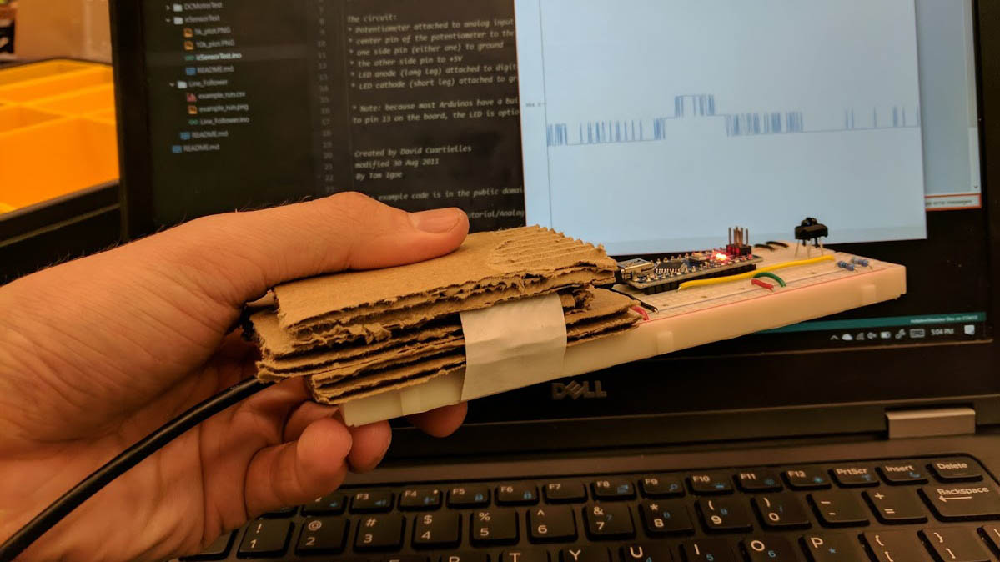
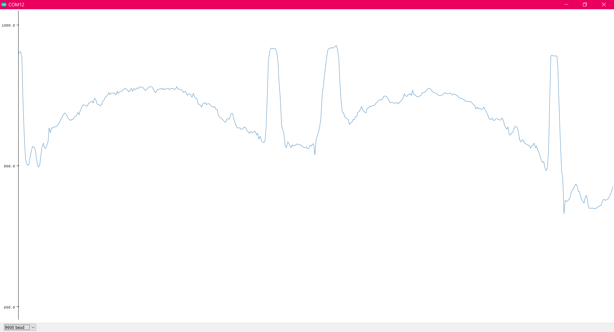
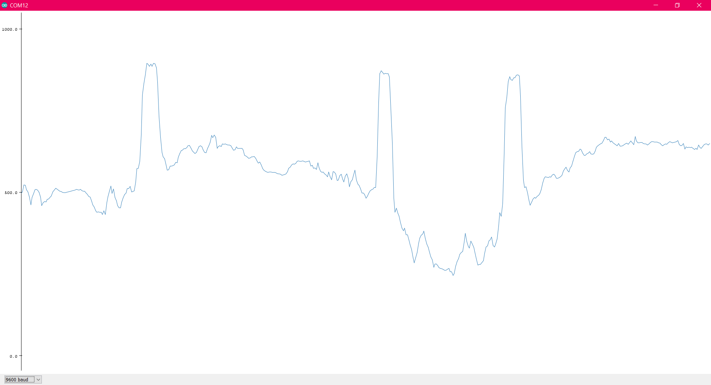

# irSensorTest

Arduino script used for testing the IR sensors

When used with the Arduino IDE's serial plotter it's easy to view the IR sensor's response with different resistor values.

## Images

Image of the testing setup

plot of IR sensor output w/ 5K resistor

plot of IR sensor output w/ 10k resistor
